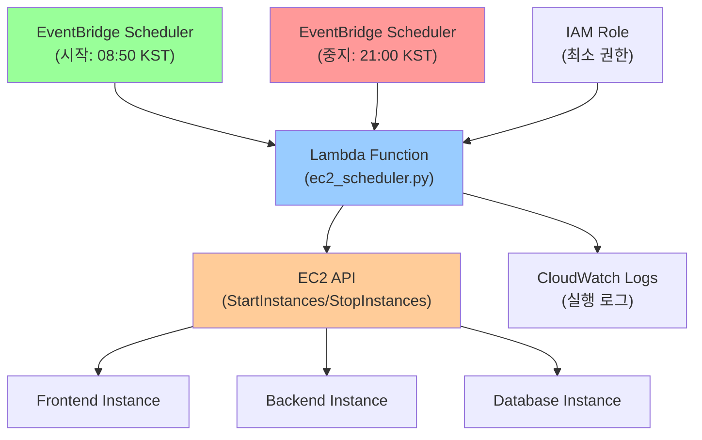

# AWS EC2 자동 스케줄링 시스템 🕒⚡

EC2 인스턴스를 자동으로 시작/중지하여 비용을 절약하는 스케줄링 시스템입니다.

## 📋 목차

- [개요](#-개요)
- [아키텍처](#-아키텍처)
- [구성 요소](#-구성-요소)
- [스케줄 설정](#-스케줄-설정)
- [동작 흐름](#-동작-흐름)
- [배포 방법](#-배포-방법)
- [모니터링](#-모니터링)
- [문제 해결](#-문제-해결)
- [비용 절약 효과](#-비용-절약-효과)
- [설정 변경](#-설정-변경)

## 🎯 개요

### 주요 기능
- **자동 시작/중지**: 설정된 시간에 EC2 인스턴스 자동 제어
- **비용 절약**: 야간/주말 자동 중지로 최대 65% 비용 절약
- **유연한 스케줄**: Cron 표현식으로 정확한 시간 설정
- **모니터링**: CloudWatch Logs로 실행 과정 추적
- **안전성**: IAM 최소 권한으로 보안 강화

### 현재 설정
- **시작 시간**: 매일 오전 8:50 (KST)
- **중지 시간**: 매일 오후 9:00 (KST)
- **대상 인스턴스**: Frontend, Backend, Database
- **운영 시간**: 12시간 10분/일 (약 51% 가동률)

## 🏗️ 아키텍처



## 🔧 구성 요소

### 1. 🔑 IAM Role
```hcl
module "lambda_scheduler_role"
```
- **서비스**: lambda.amazonaws.com
- **권한**:
  - EC2 인스턴스 시작 (`ec2:StartInstances`)
  - EC2 인스턴스 중지 (`ec2:StopInstances`)
  - CloudWatch Logs 작성
- **범위**: 특정 인스턴스만 제어 (보안 강화)

### 2. ⚡ Lambda Function
```hcl
module "ec2_scheduler_lambda"
```
- **런타임**: Python 3.12
- **핸들러**: `ec2_scheduler.lambda_handler`
- **타임아웃**: 30초
- **소스**: `lambda_scripts/ec2_scheduler.py`
- **메모리**: 128MB (기본값)

#### 환경변수
- `INSTANCE_IDS`: 제어할 인스턴스 ID 목록 (쉼표 구분)

### 3. 📅 EventBridge Scheduler

#### 시작 스케줄
```hcl
module "start_ec2_schedule"
```
- **이름**: `start-ec2-schedule`
- **표현식**: `cron(50 23 * * ? *)`
- **시간**: 매일 UTC 23:50 = **KST 08:50**
- **액션**: `{ action = "start" }`

#### 중지 스케줄
```hcl
module "stop_ec2_schedule"
```
- **이름**: `stop-ec2-schedule`
- **표현식**: `cron(0 12 * * ? *)`
- **시간**: 매일 UTC 12:00 = **KST 21:00**
- **액션**: `{ action = "stop" }`

### 4. 📊 CloudWatch Logs
```hcl
module "ec2_scheduler_logs"
```
- **로그 그룹**: `/aws/lambda/pumati-prod-ec2-scheduler-lambda`
- **보존 기간**: 7일
- **목적**: 스케줄링 실행 로그 및 디버깅

## ⏰ 스케줄 설정

### 현재 운영 시간표

| 요일 | 시작 시간 | 중지 시간 | 운영 시간 |
|------|-----------|-----------|-----------|
| 월요일 | 08:50 | 21:00 | 12시간 10분 |
| 화요일 | 08:50 | 21:00 | 12시간 10분 |
| 수요일 | 08:50 | 21:00 | 12시간 10분 |
| 목요일 | 08:50 | 21:00 | 12시간 10분 |
| 금요일 | 08:50 | 21:00 | 12시간 10분 |
| 토요일 | 08:50 | 21:00 | 12시간 10분 |
| 일요일 | 08:50 | 21:00 | 12시간 10분 |

### Cron 표현식 설명

```
cron(분 시 일 월 요일 년)
```

#### 시작 스케줄: `cron(50 23 * * ? *)`
- **50**: 50분
- **23**: 23시 (UTC)
- **\***: 매일
- **\***: 매월
- **?**: 요일 상관없음
- **\***: 매년

#### 중지 스케줄: `cron(0 12 * * ? *)`
- **0**: 0분
- **12**: 12시 (UTC)
- **\***: 매일
- **\***: 매월
- **?**: 요일 상관없음
- **\***: 매년

## 🔄 동작 흐름

### 1. 시작 프로세스 (08:50 KST)
```
EventBridge Trigger → Lambda 실행 → 환경변수에서 인스턴스 ID 조회 
→ EC2 StartInstances API 호출 → 인스턴스 상태 확인 → 로그 기록
```

### 2. 중지 프로세스 (21:00 KST)
```
EventBridge Trigger → Lambda 실행 → 환경변수에서 인스턴스 ID 조회 
→ EC2 StopInstances API 호출 → 인스턴스 상태 확인 → 로그 기록
```

### 3. 에러 처리
```
API 호출 실패 → 재시도 로직 → CloudWatch Logs 에러 기록 → 알림 (필요시)
```

## 🚀 배포 방법

### 1. 전제 조건
- AWS CLI 설정 완료
- Terraform 설치 (>= 1.0.0)
- EC2 인스턴스 ID 확인
- 적절한 IAM 권한

### 2. 인스턴스 ID 확인
```bash
# 모든 인스턴스 조회
aws ec2 describe-instances --query 'Reservations[*].Instances[*].[InstanceId,Tags[?Key==`Name`].Value|[0],State.Name]' --output table

# 특정 인스턴스 ID 확인
aws ec2 describe-instances --filters "Name=tag:Name,Values=pumati-prod-frontend" --query 'Reservations[*].Instances[*].InstanceId' --output text
```

### 3. 배포 단계
```bash
# 1. 디렉토리 이동
cd aws/prod/06-scheduling

# 2. Terraform 초기화
terraform init

# 3. 계획 확인
terraform plan

# 4. 배포 실행
terraform apply
```

### 4. 배포 후 확인
```bash
# Lambda 함수 확인
aws lambda get-function --function-name pumati-prod-ec2-scheduler-lambda

# EventBridge 규칙 확인
aws events list-rules --name-prefix "pumati-prod"

# 수동 테스트
aws lambda invoke --function-name pumati-prod-ec2-scheduler-lambda --payload '{"action":"start"}' response.json
```

## 📊 모니터링

### 1. CloudWatch Logs 확인
```bash
# 실시간 로그 모니터링
aws logs tail /aws/lambda/pumati-prod-ec2-scheduler-lambda --follow

# 특정 시간 로그 확인
aws logs tail /aws/lambda/pumati-prod-ec2-scheduler-lambda --since 1h

# 에러 로그만 필터링
aws logs filter-log-events --log-group-name /aws/lambda/pumati-prod-ec2-scheduler-lambda --filter-pattern "ERROR"
```

### 2. EventBridge 메트릭
- **SuccessfulInvocations**: 성공한 실행 횟수
- **FailedInvocations**: 실패한 실행 횟수
- **TriggeredRules**: 트리거된 규칙 수

### 3. Lambda 메트릭
- **Invocations**: 총 실행 횟수
- **Errors**: 에러 발생 횟수
- **Duration**: 평균 실행 시간
- **Throttles**: 제한 발생 횟수

### 4. EC2 인스턴스 상태 확인
```bash
# 현재 인스턴스 상태 확인
aws ec2 describe-instances --instance-ids i-1234567890abcdef0 --query 'Reservations[*].Instances[*].[InstanceId,State.Name]' --output table

# 스케줄 동작 확인을 위한 상태 모니터링
watch -n 60 'aws ec2 describe-instances --instance-ids i-1234567890abcdef0 --query "Reservations[*].Instances[*].[InstanceId,State.Name]" --output table'
```

## 🔧 문제 해결

### 1. 인스턴스가 시작/중지되지 않는 경우

**확인 사항:**
- IAM 권한 설정
- 인스턴스 ID 정확성
- EventBridge 규칙 활성화 상태

**디버깅:**
```bash
# Lambda 로그 확인
aws logs tail /aws/lambda/pumati-prod-ec2-scheduler-lambda --since 30m

# EventBridge 규칙 상태 확인
aws events describe-rule --name pumati-prod-ec2-start-rule

# 인스턴스 상태 확인
aws ec2 describe-instances --instance-ids INSTANCE_ID --query 'Reservations[*].Instances[*].State'
```

### 2. 권한 오류

**일반적인 오류:**
- `UnauthorizedOperation`: EC2 권한 부족
- `InvalidInstanceID.NotFound`: 잘못된 인스턴스 ID

**해결 방법:**
```bash
# IAM 정책 확인
aws iam get-role-policy --role-name pumati-prod-ec2-scheduler-role --policy-name pumati-prod-ec2-scheduler-inline-policy

# 인스턴스 존재 확인
aws ec2 describe-instances --instance-ids INSTANCE_ID
```

### 3. 시간대 문제

**확인 사항:**
- Cron 표현식이 UTC 기준임
- KST는 UTC+9 시간

**변경 예시:**
```hcl
# KST 09:00에 시작하려면
schedule_expression = "cron(0 0 * * ? *)"  # UTC 00:00 = KST 09:00

# KST 18:00에 중지하려면  
schedule_expression = "cron(0 9 * * ? *)"  # UTC 09:00 = KST 18:00
```

## 💰 비용 절약 효과

### 인스턴스별 예상 비용 (월)

#### 24시간 가동 시
| 인스턴스 | 타입 | 시간당 비용 | 월 비용 (24h) |
|----------|------|-------------|---------------|
| Frontend | t3.small | $0.0208 | $15.00 |
| Backend | t3.small | $0.0208 | $15.00 |
| Database | t3.small | $0.0208 | $15.00 |
| **총합** | | | **$45.00** |

#### 12시간 가동 시 (현재 설정)
| 인스턴스 | 타입 | 시간당 비용 | 월 비용 (12h) | 절약액 |
|----------|------|-------------|---------------|--------|
| Frontend | t3.small | $0.0208 | $7.50 | $7.50 |
| Backend | t3.small | $0.0208 | $7.50 | $7.50 |
| Database | t3.small | $0.0208 | $7.50 | $7.50 |
| **총합** | | | **$22.50** | **$22.50** |

### 연간 절약 효과
- **월 절약**: $22.50
- **연 절약**: $270.00
- **절약률**: 50%

### 추가 절약 옵션

#### 주말 중지 (주 5일 운영)
```hcl
# 월-금요일만 시작 (UTC 기준)
schedule_expression = "cron(50 23 ? * MON-FRI *)"

# 월-금요일만 중지
schedule_expression = "cron(0 12 ? * MON-FRI *)"
```

**예상 절약률**: 71% (주말 48시간 추가 절약)

## ⚙️ 설정 변경

### 1. 스케줄 시간 변경

#### 더 일찍 시작 (KST 07:00)
```hcl
schedule_expression = "cron(0 22 * * ? *)"  # UTC 22:00 = KST 07:00
```

#### 더 늦게 중지 (KST 23:00)
```hcl
schedule_expression = "cron(0 14 * * ? *)"  # UTC 14:00 = KST 23:00
```

### 2. 인스턴스 추가/제거

```hcl
environment_variables = {
  INSTANCE_IDS = "i-1234567890abcdef0,i-0987654321fedcba0,i-new-instance-id"
}
```

### 3. 주말 제외 설정

```hcl
# 평일만 운영
module "start_ec2_schedule" {
  schedule_expression = "cron(50 23 ? * MON-FRI *)"
}

module "stop_ec2_schedule" {
  schedule_expression = "cron(0 12 ? * MON-FRI *)"
}
```

### 4. 알림 추가 (선택사항)

```hcl
# Discord 알림 활성화 (주석 해제)
environment_variables = {
  INSTANCE_IDS        = "${local.backend_instance_id},${local.frontend_instance_id},${local.db_instance_id}"
  DISCORD_WEBHOOK_URL = "pumati-prod-discord-webhook-.env"
}
```

## 📈 사용 통계 예시

### 월간 실행 통계
- **시작 실행**: 31회 (매일)
- **중지 실행**: 31회 (매일)
- **성공률**: 100%
- **평균 실행 시간**: 3초
- **총 절약 시간**: 372시간 (31일 × 12시간)

### 일반적인 로그 패턴
```
2025-01-27 08:50:05 [INFO] Starting EC2 instances: i-abc123, i-def456, i-ghi789
2025-01-27 08:50:08 [INFO] Successfully started 3 instances
2025-01-27 21:00:05 [INFO] Stopping EC2 instances: i-abc123, i-def456, i-ghi789  
2025-01-27 21:00:11 [INFO] Successfully stopped 3 instances
```

## 🤝 운영 가이드

### 1. 정기 점검 (월 1회)
- CloudWatch Logs 에러 확인
- 인스턴스 상태 정상성 점검
- 비용 절약 효과 분석
- 스케줄 최적화 검토

### 2. 비상 시 수동 제어
```bash
# 긴급 시작
aws ec2 start-instances --instance-ids i-1234567890abcdef0

# 긴급 중지
aws ec2 stop-instances --instance-ids i-1234567890abcdef0

# 스케줄 임시 비활성화
aws events disable-rule --name pumati-prod-ec2-start-rule
```

### 3. 업데이트 절차
1. 변경 사항 테스트 환경에서 검증
2. 스케줄 임시 비활성화
3. Terraform apply로 변경 적용
4. 수동 테스트로 동작 확인
5. 스케줄 재활성화

## 📚 참고 자료

- [Amazon EventBridge 사용자 가이드](https://docs.aws.amazon.com/eventbridge/latest/userguide/)
- [AWS Lambda Python 개발자 가이드](https://docs.aws.amazon.com/lambda/latest/dg/lambda-python.html)
- [EC2 인스턴스 라이프사이클](https://docs.aws.amazon.com/AWSEC2/latest/UserGuide/ec2-instance-lifecycle.html)
- [Cron 표현식 참조](https://docs.aws.amazon.com/eventbridge/latest/userguide/eb-create-rule-schedule.html)

---

**마지막 업데이트**: 2025-01-27  
**버전**: 1.0.0  
**환경**: AWS prod  
**절약 효과**: 월 $22.50 (50% 절약) 