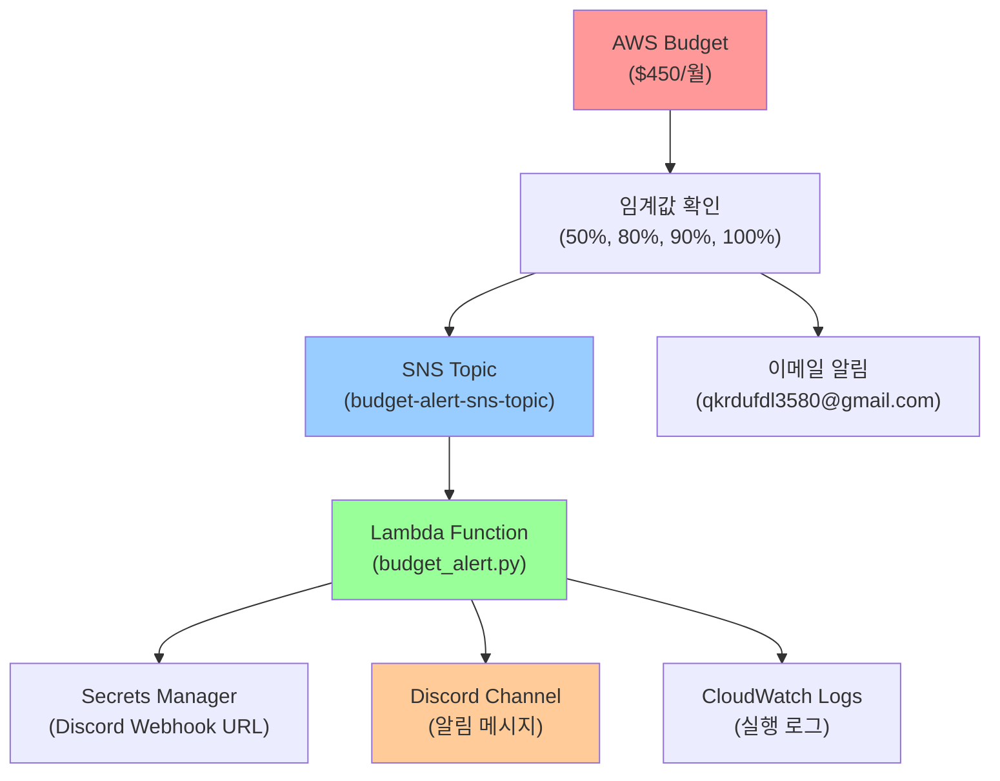

# AWS Budget Discord 알림 시스템 📊💰

AWS 비용이 설정된 임계값을 초과할 때 Discord로 실시간 알림을 받을 수 있는 예산 관리 시스템입니다.

## 📋 목차

- [개요](#-개요)
- [아키텍처](#-아키텍처)
- [구성 요소](#-구성-요소)
- [동작 흐름](#-동작-흐름)
- [설정 방법](#-설정-방법)
- [배포 방법](#-배포-방법)
- [모니터링](#-모니터링)
- [문제 해결](#-문제-해결)
- [비용 정보](#-비용-정보)

## 🎯 개요

### 주요 기능
- **실시간 비용 모니터링**: AWS 사용량을 실시간으로 추적
- **다단계 알림**: 50%, 80%, 90%, 100% 임계값별 알림
- **Discord 통합**: 팀 채널로 즉시 알림 전송
- **이메일 알림**: 기본 이메일 알림과 병행
- **보안 강화**: Secrets Manager로 민감 정보 암호화

### 현재 설정
- **월 예산**: $450
- **알림 이메일**: qkrdufdl3580@gmail.com
- **모니터링 기간**: 2025년 7월
- **리전**: ap-northeast-2 (서울)

## 🏗️ 아키텍처



## 🔧 구성 요소

### 1. 🔐 Secrets Manager
```hcl
module "discord_budget_alert_secret"
```
- **목적**: Discord Webhook URL 안전 저장
- **암호화**: KMS 키로 암호화
- **시크릿명**: `pumati-shared-discord-webhook-budget-alert-limit-.env`
- **위치**: `../../common/envs/discord/budget_alert/.env`

### 2. 🔑 IAM Role
```hcl
module "lambda_budget_alert_iam"
```
- **서비스**: lambda.amazonaws.com
- **권한**:
  - CloudWatch Logs 작성
  - SNS 메시지 발행
  - Secrets Manager 읽기

### 3. ⚡ Lambda Function
```hcl
module "budget_alert_lambda"
```
- **런타임**: Python 3.12
- **핸들러**: `budget_alert.lambda_handler`
- **타임아웃**: 10초
- **소스**: `lambda_scripts/budget_alert.py`
- **환경변수**: `DISCORD_SECRET_NAME`

### 4. 📊 CloudWatch Logs
```hcl
module "budget_alert_logs"
```
- **로그 그룹**: `/aws/lambda/pumati-shared-budget-alert-lambda`
- **보존 기간**: 7일
- **목적**: Lambda 실행 로그 및 디버깅

### 5. 📨 SNS Topic
```hcl
module "budget_alert_sns"
```
- **토픽명**: `pumati-shared-budget-alert-sns-topic`
- **구독자**: Lambda 함수
- **트리거**: AWS Budget 알림

### 6. 💰 AWS Budget
```hcl
module "budget"
```
- **유형**: COST
- **단위**: USD
- **시간 단위**: MONTHLY

#### 알림 설정
| 임계값 | 유형 | 비교 연산자 | 알림 방식 |
|--------|------|-------------|-----------|
| 50% | ACTUAL | GREATER_THAN | 이메일 + SNS |
| 80% | ACTUAL | GREATER_THAN | 이메일 + SNS |
| 90% | ACTUAL | GREATER_THAN | 이메일 + SNS |
| 100% | FORECASTED | GREATER_THAN | 이메일 + SNS |

## 🔄 동작 흐름

### 1. 비용 모니터링
```
AWS 서비스 사용 → 비용 집계 → Budget 임계값 확인
```

### 2. 알림 트리거
```
임계값 초과 감지 → SNS Topic 메시지 발행 → Lambda 함수 실행
```

### 3. Discord 알림
```
Lambda 실행 → Secrets Manager에서 Webhook URL 조회 → Discord 메시지 전송
```

### 4. 로깅
```
모든 과정 → CloudWatch Logs 기록 → 7일간 보존
```

## ⚙️ 설정 방법

### 1. Discord Webhook 설정

1. **Discord 서버에서 Webhook 생성**
   ```
   서버 설정 → 연동 → 웹후크 → 새 웹후크
   ```

2. **환경 파일 생성**
   ```bash
   # aws/common/envs/discord/budget_alert/.env
   DISCORD_WEBHOOK_URL=https://discord.com/api/webhooks/YOUR_WEBHOOK_URL
   ```

### 2. 예산 설정 수정

```hcl
# main.tf에서 예산 설정 변경
module "budget" {
  budget_limit = "450"                    # 월 예산 한도
  alert_email  = ["your-email@gmail.com"] # 알림 이메일
  start_time   = "2025-07-01_00:00"       # 시작 시간
  end_time     = "2025-07-31_23:59"       # 종료 시간
}
```

### 3. 임계값 조정

```hcl
notification_settings = [
  {
    threshold         = 50                # 50% 임계값
    threshold_type    = "PERCENTAGE"
    notification_type = "ACTUAL"
    enable_sns        = true
  },
  # 추가 임계값 설정...
]
```

## 🚀 배포 방법

### 1. 전제 조건
- AWS CLI 설정 완료
- Terraform 설치 (>= 1.0.0)
- 적절한 IAM 권한

### 2. 배포 단계

```bash
# 1. 디렉토리 이동
cd aws/shared/02-budget

# 2. Terraform 초기화
terraform init

# 3. 계획 확인
terraform plan

# 4. 배포 실행
terraform apply
```

### 3. 배포 후 확인

```bash
# Lambda 함수 확인
aws lambda list-functions --query 'Functions[?contains(FunctionName, `budget-alert`)]'

# SNS 토픽 확인
aws sns list-topics --query 'Topics[?contains(TopicArn, `budget-alert`)]'

# Budget 확인
aws budgets describe-budgets --account-id YOUR_ACCOUNT_ID
```

## 📊 모니터링

### 1. CloudWatch Logs
```bash
# 로그 그룹 확인
aws logs describe-log-groups --log-group-name-prefix "/aws/lambda/pumati-shared-budget-alert"

# 최근 로그 확인
aws logs tail /aws/lambda/pumati-shared-budget-alert-lambda --follow
```

### 2. SNS 메트릭
- **NumberOfMessagesPublished**: 발행된 메시지 수
- **NumberOfNotificationsFailed**: 실패한 알림 수

### 3. Lambda 메트릭
- **Invocations**: 실행 횟수
- **Errors**: 에러 발생 횟수
- **Duration**: 실행 시간

## 🔧 문제 해결

### 1. Discord 알림이 오지 않는 경우

**확인 사항:**
- Secrets Manager에 올바른 Webhook URL 저장 여부
- Lambda 함수의 환경변수 설정
- Discord 웹후크 URL 유효성

**디버깅:**
```bash
# Lambda 로그 확인
aws logs tail /aws/lambda/pumati-shared-budget-alert-lambda --since 1h

# Secrets Manager 확인
aws secretsmanager get-secret-value --secret-id pumati-shared-discord-webhook-budget-alert-limit-.env
```

### 2. 권한 오류

**일반적인 오류:**
- `AccessDenied`: IAM 권한 부족
- `SecretNotFound`: Secrets Manager 접근 권한 없음

**해결 방법:**
```bash
# IAM 정책 확인
aws iam get-role-policy --role-name pumati-shared-budget-alert-role --policy-name pumati-shared-budget-alert-inline-policy
```

### 3. SNS 연결 문제

**확인 사항:**
- SNS Topic과 Lambda 함수 연결 상태
- Budget에서 SNS Topic ARN 설정

## 💰 비용 정보

### 예상 월 비용 (최소)

| 서비스 | 예상 비용 | 설명 |
|--------|-----------|------|
| Lambda | ~$0.01 | 월 실행 횟수 적음 |
| SNS | ~$0.01 | 메시지 발행 비용 |
| CloudWatch Logs | ~$0.50 | 로그 저장 비용 |
| Secrets Manager | ~$0.40 | 시크릿 저장 비용 |
| **총합** | **~$0.92** | **월 최대 $1 미만** |

### 비용 최적화 팁

1. **로그 보존 기간 단축**: 7일 → 3일
2. **Lambda 메모리 최적화**: 불필요한 메모리 할당 방지
3. **SNS 필터링**: 필요한 알림만 전송

## 📝 설정 예시

### Discord 웹후크 URL 형식
```
https://discord.com/api/webhooks/123456789012345678/abcdefghijklmnopqrstuvwxyz
```

### 이메일 알림 예시
```
AWS Budget Alert: 50% of budget used
Your budget "pumati-shared-budget-budget" has exceeded 50% of the allocated amount.
Current usage: $225.00 / $450.00
```

### Discord 메시지 예시
```
🚨 AWS Budget Alert 🚨
예산: pumati-shared-budget-budget
현재 사용량: $225.00 / $450.00 (50%)
임계값 초과: 50%
```

## 🤝 기여 방법

1. 이슈 리포트
2. 기능 개선 제안
3. 코드 기여
4. 문서 개선

## 📚 참고 자료

- [AWS Budgets 사용자 가이드](https://docs.aws.amazon.com/cost-management/latest/userguide/budgets-managing-costs.html)
- [Discord Webhooks 가이드](https://support.discord.com/hc/en-us/articles/228383668-Intro-to-Webhooks)
- [AWS Lambda Python 개발자 가이드](https://docs.aws.amazon.com/lambda/latest/dg/lambda-python.html)

---

**마지막 업데이트**: 2025-01-27  
**버전**: 1.0.0  
**환경**: AWS shared 